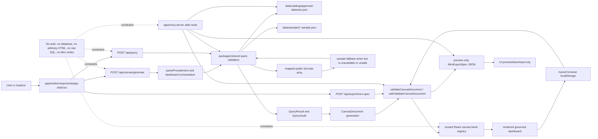

# Architecture Map

Last inspected: May 10, 2026

## System Shape

Texas Data Canvas is a pnpm monorepo with three runtime/code packages:

| Package | Role |
|---|---|
| `apps/web` | Next.js App Router web UI and API routes. |
| `apps/mcp-server` | MCP stdio server exposing the same governed catalog/query/canvas logic as tools. |
| `packages/shared` | Shared Zod schemas, TypeScript types, query execution, adapters, prompt parsing, persistence helpers, Miro export specs, and release metadata. |

Static data lives in `data`. There is no database service or ORM layer in the current repo.

## Governed Data-Flow Diagram



Key boundaries shown above:

- `/explore` talks to API routes; reusable safety logic lives in `packages/shared`.
- Catalog and sample data are checked-in JSON files under `data`; there is no database, ORM, migration layer, or server-side saved-canvas store.
- Live public API access is only through catalog-approved field mappings; user prompts do not become raw SQL or raw SoQL.
- Dashboard output is a validated `CanvasDocument` rendered through the allowlisted React block registry, not arbitrary HTML or JavaScript.
- MCP tools reuse the same catalog, query, canvas validation, source attribution, and Miro preview-spec boundaries as the web app.
- Miro export remains preview-only JSON; the app performs no OAuth flow, board write, or authenticated third-party side effect.

Important non-runtime support surfaces:

| Surface | Role |
|---|---|
| `AGENTS.md` | Repo-level safety and implementation instructions for coding agents. |
| `.agents/skills/texas-public-data-explorer/SKILL.md` | Repo-scoped skill for Texas public data, bounded query, dashboard, MCP, and Miro-spec work. |
| `SECURITY.md` | Security reporting and product safety boundaries. |
| `.github/workflows` | CI, CodeQL, hosted verification, and secret scan automation. |
| `.github/dependabot.yml` | Weekly npm and GitHub Actions dependency update config. |

## Frontend Structure

### Routes

| Route | Entry file | Purpose |
|---|---|---|
| `/` | `apps/web/app/page.tsx` | Redirects to `/explore`. |
| `/explore` | `apps/web/app/explore/page.tsx` | Main prompt-to-dashboard shell. |
| `/sources` | `apps/web/app/sources/page.tsx` | Approved catalog browser and live/sample confidence view. |
| `/saved` | `apps/web/app/saved/page.tsx` | Browser-local saved canvases, import/export, share links. |
| `/gallery` | `apps/web/app/gallery/page.tsx` | Checked-in validated demo canvas fixtures. |
| `/demo-readiness` | `apps/web/app/demo-readiness/page.tsx` | Release utility page for catalog health, gates, blockers, and handoff copy. |

Supporting App Router files:

| File | Purpose |
|---|---|
| `apps/web/app/layout.tsx` | Root HTML shell and metadata. |
| `apps/web/app/globals.css` | Tailwind imports and global body/input/link styles. |
| `apps/web/app/icon.svg` | App icon route. |

### Key Components

| Component | Owns |
|---|---|
| `apps/web/components/header.tsx` | Sticky app header, navigation, runtime version label, "No account mode" UI. |
| `apps/web/components/app-shell.tsx` | Main client state and event orchestration for `/explore`. |
| `apps/web/components/prompt-bar.tsx` | Prompt input, data-mode selector, example prompt chips. |
| `apps/web/components/dataset-sidebar.tsx` | City/topic/dataset sidebar from catalog metadata. |
| `apps/web/components/inspector-panel.tsx` | Filters, audit summaries, data-mode controls, export actions, "Why this dashboard?" panel. |
| `apps/web/components/canvas/canvas-renderer.tsx` | Validates `CanvasDocument` and dispatches blocks through the trusted registry. |
| `apps/web/components/canvas-blocks.tsx` | Renderers for each allowed block type. |
| `apps/web/components/sources-catalog.tsx` | Catalog cards, field status badges, verification notes, hidden-field warnings. |
| `apps/web/components/saved-canvases.tsx` | Local saved-canvas import/export/open/delete/duplicate/share UI. |
| `apps/web/components/gallery-canvas-list.tsx` | Renders curated gallery canvases and export/open affordances. |

### UI State

`apps/web/components/app-shell.tsx` owns most interactive UI state with React `useState`:

- prompt text
- active `CanvasDocument`
- `QueryAudit[]`
- parsed `PromptIntent`
- active `BoundedQuerySpec`
- requested/rendered data mode
- fallback reason
- filter values
- generation status
- selected Miro template and preview spec

There is no client state library. Server state is fetched through Next API routes, and saved state is browser `localStorage`.

## Backend/API Structure

All web APIs are Next.js App Router route handlers in `apps/web/app/api`.

| Endpoint | Method | File | Purpose |
|---|---:|---|---|
| `/api/health` | GET | `apps/web/app/api/health/route.ts` | Runtime, release, deployment, git, catalog, and release-evidence metadata. |
| `/api/catalog/health` | GET | `apps/web/app/api/catalog/health/route.ts` | Catalog health and fallback sample availability. |
| `/api/datasets` | GET | `apps/web/app/api/datasets/route.ts` | Full approved dataset catalog. |
| `/api/datasets/[id]` | GET | `apps/web/app/api/datasets/[id]/route.ts` | One catalog dataset by ID. |
| `/api/query` | POST | `apps/web/app/api/query/route.ts` | Runs a validated `BoundedQuerySpec` through the adapter router. |
| `/api/canvas/generate` | POST | `apps/web/app/api/canvas/generate/route.ts` | Generates a governed dashboard from prompt, filters, and data-mode preference. |
| `/api/canvas/save` | POST | `apps/web/app/api/canvas/save/route.ts` | Server-side validation stub for canvas saves; actual persistence remains client-local. |
| `/api/canvas/[id]` | GET | `apps/web/app/api/canvas/[id]/route.ts` | Returns generated seeded Dallas/Austin canvases for hardcoded IDs. |
| `/api/export/miro-spec` | POST | `apps/web/app/api/export/miro-spec/route.ts` | Validates a canvas and returns preview-only `MiroExportSpec`. |

API request parsing and public error formatting are centralized in `apps/web/lib/api.ts`. It enforces JSON body size limits from `packages/shared/src/constants.ts` and hides internal error details unless the error is a governed validation error.

`apps/web/middleware.ts` applies best-effort in-memory rate limiting to write-like public POST routes:

- `/api/canvas/generate`
- `/api/query`
- `/api/export/miro-spec`
- `/api/canvas/save`

## MCP Server Structure

| File | Purpose |
|---|---|
| `apps/mcp-server/src/index.ts` | Creates `McpServer`, registers tools, validates outputs, wraps tool errors, connects stdio transport. |
| `apps/mcp-server/src/tools.ts` | Tool implementation for catalog, query, sample rows, summaries, visualization recommendations, canvas specs, validation, source attribution, query audit, release evidence, and Miro preview. |
| `apps/mcp-server/src/data.ts` | Reads catalog, release evidence, sample rows, and creates the shared adapter router. |

The server exposes tools documented in `apps/mcp-server/README.md` and `docs/MCP_SERVER_SPEC.md`. It uses the same `packages/shared` contracts as the web app.

## Data Model And Persistence Layer

### Static Data

| Path | Data |
|---|---|
| `data/catalog/approved-datasets.json` | Approved dataset metadata, field classifications, source URLs, live adapter config, live verification notes, sample fallback files, recommended visuals, and caveats. |
| `data/samples/dallas-311.sample.json` | Dallas fallback rows. |
| `data/samples/austin-building-permits.sample.json` | Austin fallback rows. |
| `data/samples/houston-transportation-incidents.sample.json` | Houston fallback rows with precise addresses omitted. |
| `data/gallery/*.canvas.json` | Checked-in validated demo `CanvasDocument` fixtures. |
| `docs/release-evidence.json` | Release gate and hosted blocker evidence consumed by web/MCP/release checks. |

### Core Shared Types

All core shapes are defined in `packages/shared/src/schemas/index.ts`.

| Type | Purpose |
|---|---|
| `DatasetMetadata` | Catalog entry including fields, caveats, adapter metadata, and live verification. |
| `BoundedQuerySpec` | Safe query plan: dataset, mode, filters, groupBy, metrics, orderBy, and limit. |
| `QueryResult` | Rows, columns, source attribution, caveats, and data mode. |
| `QueryAudit` | Query ID, fields used, filters, row limit, aggregation flag, data mode, and safety decisions. |
| `CanvasDocument` | Validated dashboard specification rendered by the React block registry. |
| `CanvasBlock` | Discriminated union of allowed block types. |
| `SourceAttribution` | Source/method/caveat metadata required in generated dashboards. |
| `SavedCanvas` / `SavedCanvasBundle` | Browser-local saved dashboard format and portable import/export bundle. |
| `MiroExportSpec` | Preview-only JSON spec for a possible Miro briefing/workshop board. |

### Database / Schema Files

No persistent database schema files were found. Search covered common markers such as migrations, SQL files, Prisma, Supabase, Postgres, and `DATABASE_URL`.

The important caveat is that `packages/shared/src/schemas/index.ts` is a Zod contract layer for runtime validation and TypeScript inference. It is not a database schema or migration source.

### Persistence

There is no database persistence.

| Persistence type | Implementation |
|---|---|
| Catalog/sample/gallery data | Version-controlled JSON files under `data`. |
| Saved canvases | Browser `localStorage` using helpers in `apps/web/lib/saved-canvases.ts` and shared persistence utilities in `packages/shared/src/persistence/index.ts`. |
| Share links | URL hash containing a base64url-encoded saved-canvas bundle. |
| Release evidence | Checked-in JSON at `docs/release-evidence.json`. |

Verified conclusion: because no migration files, ORM config, database URL usage, persistent schema files, or database package/config surfaced in the inspected repo, database-backed multi-user persistence is not implemented.

## Authentication And Authorization

No authentication or authorization flow is present.

Verified indicators:

- Header UI in `apps/web/components/header.tsx` shows "No account mode".
- `README.md`, `SECURITY.md`, and release docs describe the app as no-auth/no-database.
- No auth provider dependency, session middleware, login route, protected route, JWT handling, or user model was found.

Authorization is replaced by data governance rules: only approved datasets and allowlisted fields can be queried/rendered.

If auth is added later, it will be a new architecture boundary. The current app assumes all public routes are accessible and protects only data/query/canvas safety.

## Main Request And Data Flows

### Prompt-To-Dashboard

```text
/explore UI
  -> AppShell.generateDashboard()
  -> POST /api/canvas/generate
  -> parseJsonRequest() with Zod request schema
  -> generateCanvasForPrompt()
  -> parsePromptIntent()
  -> detectIntent() for Dallas/Austin/Houston supported workflows
  -> buildFilters() and dashboardMode()
  -> create five BoundedQuerySpec objects
  -> adapterRouter.queryDataset() for monthly/category/ZIP/status/table aggregates
  -> executeBoundedQuery() or live Socrata adapter with fallback
  -> create SourceAttribution and QueryAudit records
  -> validateCanvasDocument()
  -> JSON response
  -> CanvasRenderer.safeValidateCanvasDocument()
  -> trusted block registry renders UI
```

Business logic for this flow lives mostly in:

- `apps/web/lib/dashboard.ts`
- `packages/shared/src/prompt/index.ts`
- `packages/shared/src/query/index.ts`
- `packages/shared/src/adapters/index.ts`
- `packages/shared/src/canvas/index.ts`

### Direct Query API

```text
POST /api/query
  -> parseJsonRequest() using boundedQuerySpecSchema
  -> getDatasetAdapter().queryDataset()
  -> createAdapterRouter()
  -> validateBoundedQuerySpec()
  -> static sample query OR live Socrata query with fallback
  -> QueryExecution { result, audit }
```

### Saved Canvas Flow

```text
User clicks Save
  -> saveCanvasLocally()
  -> createSavedCanvas()
  -> savedCanvasSchema / canvasDocumentSchema validation
  -> localStorage["texas-data-canvas:saved-canvases"]

User opens /saved
  -> listSavedCanvases()
  -> SavedCanvases UI

User imports JSON/hash
  -> parseSavedCanvasImport()
  -> canvas and bundle validation
  -> localStorage write
```

### Seed Canvas Lookup Flow

```text
GET /api/canvas/[id]
  -> hardcoded savedCanvases map in apps/web/app/api/canvas/[id]/route.ts
  -> generateCanvasForPrompt(prompt)
  -> return generated canvas or 404
```

This is not a persistence layer. It is a small seed/demo helper with Dallas and Austin IDs.

### Source Catalog Flow

```text
/sources
  -> getDatasetCatalog()
  -> approvedDatasetCatalogSchema.parse()
  -> getCatalogHealth()
  -> SourcesCatalog renders dataset cards and field status
```

### Miro Preview Flow

```text
User clicks Miro preview
  -> POST /api/export/miro-spec
  -> request schema validates template and canvas input
  -> generateMiroExportSpec()
  -> safeValidateCanvasDocument()
  -> miroExportSpecSchema.parse()
  -> preview JSON returned to UI
```

There are no Miro side effects or external writes.

## Validation Boundaries

| Boundary | Validation |
|---|---|
| Catalog load | `approvedDatasetCatalogSchema` in `apps/web/lib/data.ts` and `apps/mcp-server/src/data.ts`. |
| API body parsing | `parseJsonRequest()` in `apps/web/lib/api.ts` with route-local Zod schemas. |
| Query specs | `boundedQuerySpecSchema` plus `validateBoundedQuerySpec()` in `packages/shared/src/query/index.ts`. |
| Dataset/field access | `getApprovedDataset()`, `getDatasetField()`, hidden/review field checks, row limit checks. |
| Live Socrata queries | `buildSocrataQueryUrl()` uses catalog `liveFieldMap`; callers cannot provide raw SoQL. |
| Canvas rendering | `canvasDocumentSchema` requires allowlisted blocks and `SourceMethodBlock`; rejects script-like strings. |
| Saved imports/share links | `parseSavedCanvasImport()`, import byte limits, saved/canvas bundle schemas. |
| Miro preview | `safeValidateCanvasDocument()` and `miroExportSpecSchema`. |
| MCP tool inputs/outputs | Tool input schemas and output schemas in `apps/mcp-server/src/index.ts`. |
| Governance release checks | `scripts/governance-audit.mjs`, `scripts/data-quality.mjs`, `scripts/preflight.mjs`. |

Validation gaps to keep in mind:

- The API validates JSON shapes and governed fields, but public hosted abuse protection still needs platform-level firewall/rate limiting.
- Saved share links validate imported bundles, but they are still URL-hash sized and browser-local.
- Live public API metadata is only as current as `data/catalog/approved-datasets.json` and `liveVerification.lastCheckedAt`.

## Where Business Logic Lives

| Logic | Primary files |
|---|---|
| Prompt support, dashboard generation, filter handling, block composition | `apps/web/lib/dashboard.ts` |
| Prompt intent parsing, sensitive prompt detection, synonym matching | `packages/shared/src/prompt/index.ts` |
| Query validation and static sample aggregation | `packages/shared/src/query/index.ts` |
| Static JSON adapter, Socrata URL builder, live fallback routing | `packages/shared/src/adapters/index.ts` |
| Canvas validation helpers | `packages/shared/src/canvas/index.ts` |
| Saved-canvas storage and bundle import/export | `packages/shared/src/persistence/index.ts`, `apps/web/lib/saved-canvases.ts` |
| Miro export spec generation | `packages/shared/src/miro/index.ts` |
| Data file loading and catalog health | `apps/web/lib/data.ts`, `apps/mcp-server/src/data.ts` |
| API errors and JSON body limits | `apps/web/lib/api.ts` |

## Side Effects

| Side effect | Where |
|---|---|
| Reads catalog/sample/gallery/release JSON from disk | `apps/web/lib/data.ts`, `apps/mcp-server/src/data.ts`, scripts |
| Fetches live public Socrata endpoints | `packages/shared/src/adapters/index.ts`, `scripts/smoke-live.mjs` |
| Writes browser `localStorage` | `apps/web/lib/saved-canvases.ts`, `packages/shared/src/persistence/index.ts` |
| Copies text to clipboard / downloads blobs | `apps/web/components/app-shell.tsx`, `apps/web/components/saved-canvases.tsx`, `apps/web/components/gallery-canvas-list.tsx` |
| Applies in-memory POST rate limit | `apps/web/middleware.ts` |
| Starts local Next server for e2e/release checks | `playwright.config.ts`, `scripts/verify-prod-local.mjs` |
| Writes build/test output | `pnpm build`, `pnpm test:e2e`, `pnpm verify:prod-local` |
| MCP stdio IO | `apps/mcp-server/src/index.ts` |

No current side effect writes to a database, queue, Miro board, external storage bucket, or authenticated third-party service.

## Background Jobs, Webhooks, Queues, Scheduled Tasks

No runtime background jobs, webhooks, queues, cron jobs, or scheduled workers were found in application code.

CI workflows exist under `.github/workflows`:

- `.github/workflows/ci.yml`
- `.github/workflows/codeql.yml`
- `.github/workflows/deploy-verify.yml`
- `.github/workflows/secret-scan.yml`

These are repository automation, not app runtime jobs.

## Integrations

| Integration | Implementation status |
|---|---|
| Socrata/Tyler public data APIs | Implemented for live-capable catalog fields with strict mapping and sample fallback. |
| Houston TranStar | Documented/sample-first only. No live adapter promoted. |
| Miro | Preview-only JSON spec. No auth or writes. |
| Vercel | Deployment/runbook/check scripts and health metadata. No project metadata or secrets committed. |
| MCP | Implemented stdio server with typed tools. |

## Architecture Reviewer Notes

- The high-level architecture is clear and intentionally conservative: static approved data plus governed live adapters plus validated canvas rendering.
- The biggest ambiguity for future agents is terminology around "schema": shared Zod schemas are central, but no database schema exists.
- The current `/api/canvas/save` route validates a canvas but does not persist it; client-side localStorage does the real save.
- The current `/api/canvas/[id]` route is a hardcoded demo lookup, not an object store.
- Hosted production readiness depends on external Vercel/platform configuration that is not represented in app code.
