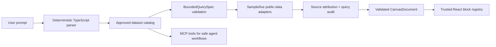

# CivicCanvas

Open-source, MCP-powered visual explorer for Texas public datasets.

## Hackathon Submission Checklist

- Public repo: https://github.com/magospace/CivicCanvas
- Track: Brainforge / Vicinity Texas Open Data Track.
- Quick start: `pnpm install` then `pnpm dev`; open `http://localhost:3000/explore`.
- Demo reproduction: open `/sources`, run the Dallas 311 prompt in `/explore`, show source/method/caveats/query audit, save/share locally, then mention the MCP server and agent skill.
- MCP/agent proof: `pnpm --filter @texas-data-canvas/mcp-server build`, `pnpm --filter @texas-data-canvas/mcp-server inspect`, and `pnpm test -- apps/mcp-server/test/tools.test.ts` prove the custom server/skill path without secrets.
- Env vars: sample mode requires no secrets. Optional server-side OpenAI prompt-assist uses `OPENAI_API_KEY` from `.env.local` or the server environment; keys are never exposed to the browser.
- Dataset/synthetic data provenance: approved catalog metadata lives in `data/catalog/approved-datasets.json`; Dallas/Austin/Houston sample rows live in `data/samples/*.sample.json` and are schema-aligned fallback samples with provenance/caveats visible in the UI.
- Known limitations and next steps: no backend saved-canvas database, no arbitrary SQL/dataset access, no live Miro writes, limited live public API coverage, and hosted firewall/rate-limit proof remains a deployment task.

## Using Provided Keys

The public repo never includes real provider credentials. If the team gives you a key separately, copy `.env.example` to `.env.local`, paste the value there, and restart the dev server.

```bash
cp .env.example .env.local
```

Use `OPENAI_API_KEY` only for optional server-side prompt assist and source-aware summary wording. Do not commit `.env.local`, paste real keys into issues, or expose keys as `NEXT_PUBLIC_*` values.

## What it does

Users ask natural-language questions about Texas public data. The app parses supported prompts with deterministic local TypeScript rules, discovers approved public datasets, runs safe bounded queries, and renders interactive dashboards with maps, charts, tables, filters, summaries, and source attribution. OpenAI is optional and server-side only for prompt-assist/summary wording when `OPENAI_API_KEY` is configured; it is not required for the default local demo and cannot generate dashboard code, arbitrary SQL, non-catalog dataset access, or hidden-field overrides.

Optional stretch: generate preview-only MiroExportSpec JSON for briefing boards, slide-like frames, or workshop boards. The app does not create or update Miro boards.

## Architecture at a glance



This flow is deterministic and governed: no LLM-generated dashboard code, no arbitrary SQL, no backend saved-canvas database, and no live media generation run by the app. Live public-data access is dataset/field-gated and falls back to approved samples when unsafe or unavailable.

## MVP workflows

1. Dallas 311 service requests by category and ZIP code for 2024.
2. Austin building permits by month and ZIP code.
3. Houston transportation incidents by incident type and ZIP code for 2024.

## Core safety model

- No arbitrary AI-generated runtime HTML/JavaScript.
- No LLM-backed dashboard generation or required model/provider secret.
- Optional OpenAI prompt-assist and source-summary helpers are server-side only, schema-validated, and deterministic-fallback by default.
- No arbitrary SQL.
- Use CanvasSpec JSON + trusted React block registry.
- Use BoundedQuerySpec + approved dataset catalog.
- Always include SourceMethodBlock.

## Setup

```bash
pnpm install
pnpm dev
```

Open `http://localhost:3000/explore` for the main app shell.

Useful routes:

- `/explore` - prompt-to-dashboard canvas shell.
- `/sources` - approved catalog and live/sample confidence notes.
- `/saved` - browser-local saved canvases, portable JSON bundles, and URL-hash share links.
- `/gallery` - checked-in validated demo canvases rendered through the allowlisted block registry.
- `/demo-readiness` - utility release console with catalog health, known boundaries, gate commands, and hosted blockers.

## MCP / Agent Quick Proof

CivicCanvas includes a custom MCP server and repo-scoped agent skill for the Brainforge / Vicinity track. The MCP tools use the same approved catalog, bounded query specs, Zod schemas, sample/live adapters, hidden-field rules, and source attribution paths as the web app; they are not hardcoded demo arrays, arbitrary SQL access, or production database access.

```bash
pnpm --filter @texas-data-canvas/mcp-server build
pnpm --filter @texas-data-canvas/mcp-server inspect
pnpm test -- apps/mcp-server/test/tools.test.ts
```

Show or cite `.agents/skills/texas-public-data-explorer/SKILL.md` as the agent skill proof. The safe Loom path is source discovery → catalog health → bounded query → query audit → validated `CanvasDocument` → preview-only `MiroExportSpec`. Miro output is JSON preview only; there is no OAuth, board ID, access token, or live board write.

Use `docs/MCP_DEMO_PROOF.md` and `docs/MCP_DEMO_TRANSCRIPT_TEMPLATE.md` for a paste-safe transcript.

## Verification

Daily local checks for normal development:

```bash
pnpm lint
pnpm typecheck
pnpm test
```

Add focused checks when the change touches specific surfaces:

```bash
pnpm governance:audit   # catalog/sample/gallery and public-data governance checks
pnpm data:quality       # sample row counts, date ranges, ZIP gaps, and demo sanity
pnpm test:e2e           # local browser workflow and accessibility checks
```

Release and deployment gates are broader than daily checks and may write local build/test output or require a production-style server:

```bash
pnpm build
pnpm preflight
pnpm verify:prod-local
pnpm verify:vercel-output
pnpm release:check
pnpm verify
```

Network-dependent or environment-dependent checks:

```bash
pnpm smoke:live
pnpm smoke:live:json
pnpm smoke:deploy -- --url http://localhost:3000
pnpm smoke:deploy:json -- --url http://localhost:3000
PLAYWRIGHT_BASE_URL=https://your-deployment.example pnpm test:e2e:remote
```

Optional Fal media-provider proof is no-spend by default and not wired into dashboard generation:

```bash
pnpm media:fal:smoke:json
RUN_LIVE_FAL_SMOKE=1 FAL_KEY=<redacted> pnpm media:fal:smoke:json
```

Optional OpenAI prompt-assist proof is also no-spend by default. The live form makes one minimal server-side structured-output call when the key and gate are deliberately present:

```bash
pnpm provider:openai:smoke:json
RUN_LIVE_OPENAI_SMOKE=1 OPENAI_API_KEY=<redacted> pnpm provider:openai:smoke:json
```

The default provider smoke commands make no provider calls. The live commands are explicitly gated, perform at most one minimal proof request each, validate or summarize only provider readiness/proof metadata, and must not be used unless billing risk and credentials are intentionally approved.

`pnpm smoke:live` is optional and only checks catalog entries with `liveAvailable: true`.
`pnpm smoke:deploy` requires a running local or hosted URL.
`pnpm verify:prod-local` builds `apps/web`, runs `next start` on an available local port, then runs hosted-style smoke and remote-mode Playwright against that production server.
`pnpm verify:vercel-output` inspects `.vercel/output` after `vercel build` when available, and skips output inspection safely when it is absent.
`pnpm verify` runs the local release gate: preflight, live smoke, and Playwright browser smoke.
Do not refresh `docs/release-evidence.json` as part of daily checks; refresh it only after intentionally rerunning the relevant release gate for the intended release commit.

Cleanup command, only when intentionally resetting local artifacts:

```bash
pnpm clean
```

## Contributing And Security

- License: MIT; see `LICENSE`.
- Contribution guide: `CONTRIBUTING.md`.
- Code of conduct: `CODE_OF_CONDUCT.md`.
- Security reporting and safety boundaries: `SECURITY.md`.

Public deployments must configure platform-level firewall/rate limiting before broad sharing. The in-repo middleware throttle is defense in depth for local/demo checks only and is not a substitute for Vercel-native firewall, WAF, bot-protection, or edge rate-limit controls in a serverless environment. Do not claim hosted abuse protection is configured until a dedicated hosted-readiness task records provider-specific proof.

## MVP demo prompts

Use `/explore` and run:

```text
Show Dallas 311 service requests by category and ZIP code for 2024.
Show Austin building permits by month and ZIP code.
Show Houston traffic incidents by ZIP and incident type for 2024.
```

Unsupported prompts return approved dataset suggestions instead of hallucinated dashboards.

## Data modes

The dashboard prompt bar and inspector expose the same governed data modes used by the APIs and MCP server:

- Auto: use live public APIs only when the approved catalog marks the requested dataset and fields as live-ready.
- Live public API: request live data and fall back to approved samples with a visible caveat if live access is unavailable or unsafe.
- Sample fallback: force local sample data for deterministic demos.

## Known sample/live boundaries

- Dallas 311 live aggregates are promoted only for verified non-ZIP mapped fields. Dallas ZIP dashboard views intentionally use sample fallback because the verified live Socrata view does not expose ZIP.
- Austin permit metadata is verified, but monthly live aggregation remains sample-first until a source-owned month grouping is safely verified.
- Houston transportation incidents is the public-pilot third dataset. It is sample-first, excludes precise locations, and remains live-disabled. Houston TranStar provides sample feed documentation, but live feed access and aggregate-safe mappings are not promoted yet.
- Sample fallback remains mandatory for every live-enabled dataset so public demos stay reliable when live portals time out or reject a safe aggregate.

## MCP server

```bash
pnpm --filter @texas-data-canvas/mcp-server build
pnpm --filter @texas-data-canvas/mcp-server inspect
```

The MCP server exposes safe catalog, query, source attribution, audit, canvas, visualization, and Miro export-spec tools. All dataset queries are bounded and catalog-validated.

Production-pilot health surfaces are available at `/api/health`, `/api/catalog/health`, and MCP tools `get_server_status`, `validate_catalog`, and `list_live_sources`.

## Deployment

The web app is ready for Vercel-style deployment from this monorepo. For hosted deployment, use the manual runbook in `docs/HOSTED_BETA_DEPLOYMENT.md`; the public GitHub repo is configured at `https://github.com/magospace/CivicCanvas`. A manual hosted verification workflow is present for checking an already-deployed URL.

```bash
pnpm preflight
pnpm --filter @texas-data-canvas/web build
```

Recommended Vercel settings:

- Install command: `pnpm install --frozen-lockfile`
- Build command: `pnpm --filter @texas-data-canvas/web build`
- Output framework: Next.js
- Required secrets: none for sample mode
- Hosted beta env: `NEXT_PUBLIC_APP_ENV=hosted-beta`
- Hosted beta version: set the release being verified, for example `NEXT_PUBLIC_APP_VERSION=v1.3.0-hosted-launch-readiness`
- Optional site URL: `NEXT_PUBLIC_SITE_URL=https://your-public-beta.example`

Set hosted beta `NEXT_PUBLIC_*` values before building; Next.js captures them into the production bundle.

Sample mode requires no secrets. Live Socrata adapters use verified catalog field mappings and keep sample fallbacks for demos.

Optional OpenAI support uses `OPENAI_API_KEY` from `.env.local` or the server environment only. When the key is missing, `/explore` labels prompt help as "Guided suggestions" and the provider wrapper uses deterministic parsing/templates. When the key is present, health metadata reports only `keyStatus: present`; keys must never be exposed to client bundles, screenshots, logs, browser JSON, or generated proof artifacts.

The health route exposes media-generation status. Current dashboard generation does not create image/video artifacts, upload media, or call Fal by default. `pnpm media:fal:smoke:json` is an optional script-level proof path; the app health metadata labels it as `RUN_LIVE_FAL_SMOKE=1` gated and separate from normal dashboard rendering.

After deploying, smoke-check the public URL:

```bash
pnpm smoke:deploy -- --url https://your-deployment.example --expect-version v1.3.0-hosted-launch-readiness
```

Saved canvases remain browser-local. Use `/saved` to export/import portable saved-canvas bundles for demos and handoffs. Share links place the validated bundle in the URL hash and import only after schema validation; they are not public database-backed URLs.

The `/api/canvas/save` route is a validation stub for API and contract checks. It validates a `CanvasDocument` and returns the validated canvas ID, but it does not write to a server store, database, account, or public share service. The visible save workflow writes only to browser `localStorage`.

The `/explore` inspector includes a "Why this dashboard?" section with matched prompt terms, reason codes, safety decisions, selected data mode, and active bounded query JSON. Dashboard exports stay client-side and governed: current table CSV, validated `CanvasDocument` JSON, and active `BoundedQuerySpec` JSON.

The `/demo-readiness` route is a utility page for checking release gates and public-demo boundaries. It is intentionally not a marketing landing page.

## Workspace packages

- `apps/web` - Next.js App Router frontend shell.
- `apps/mcp-server` - typed MCP server for safe catalog, query, audit, canvas, and export tools.
- `packages/shared` - Zod schemas and TypeScript types shared across the app.

## Data files

- `data/catalog/approved-datasets.json`
- `data/samples/dallas-311.sample.json`
- `data/samples/austin-building-permits.sample.json`
- `data/samples/houston-transportation-incidents.sample.json`
- `data/gallery/*.canvas.json`

The frontend validates catalog data and renders dashboards through a trusted React block registry. It does not execute AI-generated HTML, JavaScript, external scripts, SQL, or arbitrary components.

There is no image, video, media-generation, upload, storage-bucket, or paid creative-provider path in the current app. Visual output is limited to validated dashboard UI, static brand assets, client-side CSV/JSON downloads, checked-in gallery canvases, and preview-only MiroExportSpec JSON.

Brand assets live under `apps/web/public/brand/`. The header uses the compact CivicCanvas mark and product label.

## Current developer docs

- [Codebase overview](CODEBASE_OVERVIEW.md)
- [Architecture map](ARCHITECTURE_MAP.md)
- [Development guide](DEVELOPMENT_GUIDE.md)
- [Live/fallback proof matrix](docs/LIVE_FALLBACK_PROOF.md)
- [Supported prompt grammar](docs/SUPPORTED_PROMPTS.md)
- [Catalog onboarding checklist](docs/CATALOG_ONBOARDING_CHECKLIST.md)
- [Demo video capture checklist](docs/DEMO_VIDEO_CHECKLIST.md)
- [Local demo readiness checklist](docs/HACKATHON_DEMO_READINESS.md)
- [Hackathon submission checklist](docs/HACKATHON_SUBMISSION_CHECKLIST.md)
- [Hackathon submission guide](docs/HACKATHON_SUBMISSION_GUIDE.md)
- [Fal live proof template](docs/FAL_LIVE_PROOF_TEMPLATE.md)
- [Hosted smoke template](docs/HOSTED_SMOKE_TEMPLATE.md)
- [MCP demo proof checklist](docs/MCP_DEMO_PROOF.md)
- [MCP demo transcript template](docs/MCP_DEMO_TRANSCRIPT_TEMPLATE.md)
- [Sample and persistence realness matrix](docs/SAMPLE_AND_PERSISTENCE_REALNESS.md)
- [Local persistence spike plan](docs/LOCAL_PERSISTENCE_SPIKE.md)
- [Agent instructions](AGENTS.md)
- [Roadmap](ROADMAP.md)
- [Task list](TASKS.md)

## Key docs

- `docs/PRD.md`
- `docs/MVP_BUILD_BRIEF.md`
- `docs/AGENT_DEVELOPMENT_PLAN.md`
- `docs/ARCHITECTURE.md`
- `docs/MCP_SERVER_SPEC.md`
- `docs/DATA_GOVERNANCE.md`
- `docs/ACCEPTANCE_CRITERIA.md`
- `docs/V1_PUBLIC_PILOT_PLAN.md`
- `docs/V1_1_PRODUCT_DEPTH_PLAN.md`
- `.agents/skills/texas-public-data-explorer/SKILL.md`
