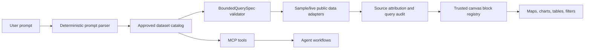

# CivicCanvas Hackathon Submission Guide

Due: May 10, 2026 at 11:00 AM CST.

Source note: Adopted from root-level submission-guide input. Keep local/sample/live/browser-local boundaries honest; do not treat historical release evidence as current proof unless gated Task 35 reruns the full release gate.

## Submission Fields

- Project title: CivicCanvas
- Suggested team name: CivicCanvas
- Track: Brainforge / Vicinity Texas Open Data Track
- Repo link: TODO. This git checkout currently has no remote configured, so create/push a public GitHub repo before submitting.
- Deployed URL: TODO if deployed. If not deployed, submit the Loom and note local demo at `http://localhost:3000/explore`.
- Loom video: TODO. Must be recorded with Loom and kept between 2 and 5 minutes.
- Team roster: TODO. Add names, roles, and contact emails/handles.

## 150-300 Word Write-Up Draft

Texas public datasets are powerful, but they are often scattered across city portals, difficult to query, and hard to trust without context. CivicCanvas helps civic builders, journalists, organizers, and local teams turn approved public datasets into clear, source-cited dashboards.

The app lets a user type a supported plain-English prompt, such as Dallas 311 requests by category and ZIP code, Austin building permits by month and ZIP code, or Houston transportation incidents by type. Instead of generating arbitrary code, it uses deterministic TypeScript parsing, an approved dataset catalog, bounded query specs, and a trusted React canvas block registry. Every result includes maps, charts, tables, filters, source attribution, caveats, and a visible query audit so users can understand where the numbers came from and when sample fallback is being used.

For the Brainforge / Vicinity track, CivicCanvas includes both a custom MCP server and a proper agent skill. Agents can discover approved Texas data sources, run safe bounded queries, validate catalog health, summarize results, generate canvas specs, and produce preview-only Miro export specs without exposing hidden fields or running arbitrary SQL.

The impact is safer, more approachable public-data exploration: useful visuals without pretending incomplete data is complete, and agent workflows that are powerful but constrained.

## Core Product Outline

- Visual explorer for Texas open data at `/explore`.
- Approved source catalog at `/sources`.
- Local saved canvases and hash-share bundles at `/saved`.
- Checked-in demo canvases at `/gallery`.
- Demo readiness and boundary console at `/demo-readiness`.
- MCP server under `apps/mcp-server`.
- Agent skill at `.agents/skills/texas-public-data-explorer/SKILL.md`.

## Architecture Diagram

## Demo Plan For Loom

Target: 3 minutes.

1. Start on `/sources`. Show Dallas, Austin, and Houston approved datasets, plus live/sample confidence notes.
2. Go to `/explore` and run: `Show Dallas 311 service requests by category and ZIP code for 2024.`
3. Show the map, chart, table, Source & Method card, and query audit. Say the ZIP view uses visible sample fallback because the verified live Socrata view does not expose ZIP.
4. Run one secondary prompt: `Show Austin building permits by month and ZIP code for 2024.` or `Show Houston transportation incidents by ZIP and incident type for 2024.`
5. Save locally, open `/saved`, and mention saved canvases are browser-local, not a database.
6. Show the MCP/agent angle briefly: mention the repo ships a custom MCP server plus agent skill for safe discovery, bounded query, summaries, canvas generation, and preview-only Miro export specs.
7. Close with: "CivicCanvas makes Texas public data explorable without hiding source limitations."

## README Requirement Check

- Quick start: present in `README.md`.
- Tech stack and architecture: mostly present across `README.md`, `ARCHITECTURE_MAP.md`, and `CODEBASE_OVERVIEW.md`. Add the diagram above to the README if time permits.
- Demo reproduction: present, including prompts and commands.
- Env vars/API keys/sample `.env`: present in `.env.example`; sample mode requires no secrets.
- Datasets and provenance: present through catalog/sample docs. Keep saying "synthetic/schema-aligned samples" where relevant.
- Known limitations and next steps: present, especially around no DB persistence, sample fallback, no auth, preview-only Miro, and historical release evidence.

## Submission Readiness

Status: strong local Brainforge submission, but repo/deploy form fields remain incomplete.

- Must do before Airtable: publish a public repo and paste the link.
- Must do before Airtable: record Loom with camera on.
- Should do if possible: deploy to Vercel and smoke-check the URL.
- Should do if possible: run `pnpm lint`, `pnpm typecheck`, `pnpm test`, `pnpm governance:audit`, and `pnpm data:quality` before recording.
- Be careful: do not claim complete live Texas coverage, database persistence, LLM-generated dashboards, or live Miro board writes.

## Scoring Estimate

Estimated range: 84-90/100 if the Loom clearly shows the MCP server/agent skill requirement and safe visual data workflow.

- Technical execution and completeness: 22/25. Working monorepo, visual UI, safe schemas, MCP tools, and tests.
- Partner ecosystem and utility: 23/25. Very strong fit for Brainforge/Vicinity because it uses Texas open data plus MCP/skill.
- Value and impact: 22/25. Clear civic-data utility with responsible source attribution.
- Innovation and execution: 20/25. Strong governance angle; less flashy because sample fallback is central and no live broad search.

Fastest score boosters:

- Add the architecture diagram to the README.
- Show the MCP tools and skill in the Loom, even for 15 seconds.
- Deploy and smoke-test a public URL if time allows.
